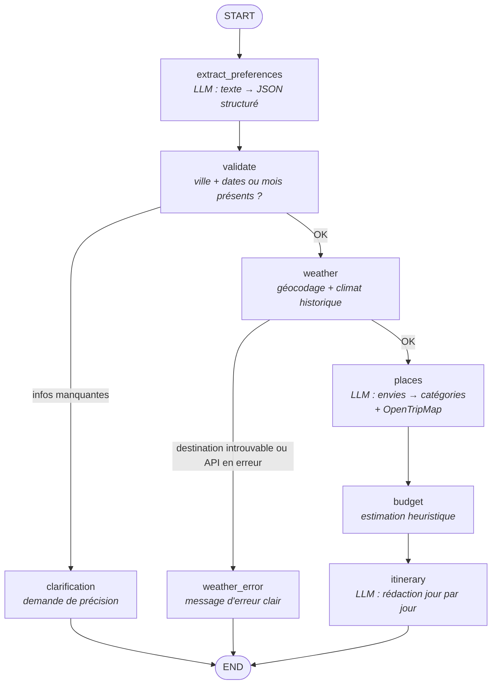
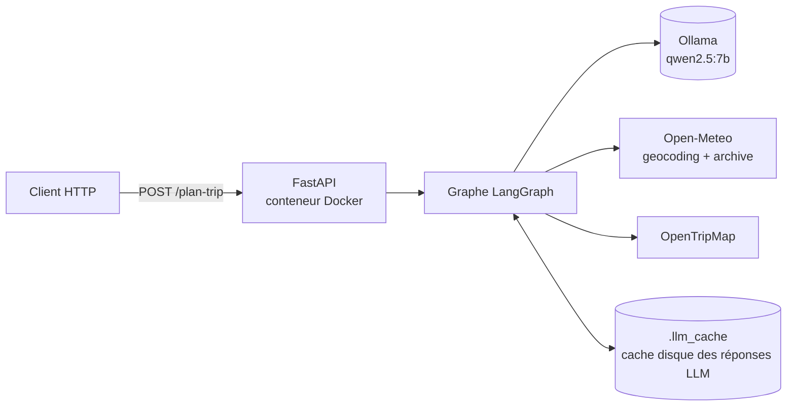

# TripPilot

Assistant de voyage en langage naturel. On lui écrit « Lisbonne en mai pendant 5 jours » et il renvoie un itinéraire jour par jour, avec la météo attendue (moyennes historiques), des lieux à visiter et une estimation de budget.

L'agent est un graphe **LangGraph** dont les étapes d'interprétation et de rédaction sont confiées à un LLM local (**Ollama + qwen2.5**), et les données factuelles à des API ouvertes (**Open-Meteo**, **OpenTripMap**). Le tout est exposé par une API **FastAPI**.

---

## Architecture

### Le graphe LangGraph



Chaque nœud lit et enrichit un état partagé (`agent/state.py`). Les trois nœuds terminaux écrivent `final_response` et `source_node`, ce qui permet à l'API de savoir si la réponse est un itinéraire, une demande de clarification ou une erreur.

| Nœud | Rôle | Appel externe |
|---|---|---|
| `extract_preferences` | Extrait ville, pays, dates, durée, voyageurs, budget, envies | Ollama (sortie JSON contrainte par schéma) |
| `validate` | Vérifie qu'on a une ville et des dates précises **ou** un mois + une année | — |
| `weather` | Géocode la destination, calcule le climat attendu | Open-Meteo Geocoding + Archive |
| `places` | Traduit les envies en catégories, récupère les lieux | Ollama (si envies) + OpenTripMap |
| `budget` | Estime le budget si l'utilisateur n'en a pas donné | — |
| `itinerary` | Rédige l'itinéraire final en markdown | Ollama |

### Vue d'ensemble



### Structure du projet

```
src/trippilot/
├── main.py            # app FastAPI + GET /health
├── config.py          # modèle Ollama, tarifs du budget, noms des mois
├── api/               # POST /plan-trip, schémas Pydantic
├── agent/
│   ├── graph.py       # nœuds et câblage du graphe
│   ├── state.py       # état partagé (TypedDict)
│   ├── prompts.py     # prompts d'extraction, de catégories, d'itinéraire
│   └── cache.py       # cache disque des appels Ollama
└── tools/
    ├── weather.py     # géocodage + climat historique (Open-Meteo)
    └── places.py      # lieux et activités (OpenTripMap)
tests/                 # tests unitaires (aucun appel Ollama ni réseau)
eval/                  # jeu d'évaluation de l'agent de bout en bout
```

---

## Exemple

### Itinéraire complet

```http
POST /plan-trip
Content-Type: application/json

{"query": "Rome en juin 2026"}
```

Réponse (raccourcie) :

```json
{
  "itinerary": "# Itinéraire de voyage pour Rome du 2026-06-22 au 2026-06-28\n## Jour 1 — 2026-06-22\nRome est en pleine période estivale, avec des températures allant de 20 à 33°C...\n**Matin :** Commencez par le **Tempio di Minerva Medica**...\n\n## Budget et conseils\n...",
  "clarification_needed": null,
  "error": null,
  "weather": {
    "avg_temp_max": 32.9,
    "avg_temp_min": 20.4,
    "avg_precipitation_mm": 0.4,
    "note": "Meilleure période de 7 jours trouvée dans le mois, basée sur 5 ans d'historique."
  },
  "budget": "~770€ (estimation : hébergement/repas + 14 activités)",
  "places": [
    {"name": "Tempio di Minerva Medica", "kinds": "religion,other_temples,historic,archaeology,...", "rate": 7},
    {"name": "Aurelian Walls", "kinds": "fortifications,defensive_walls,historic,...", "rate": 7}
  ]
}
```

Seul le mois était donné : l'agent a cherché la meilleure fenêtre de 7 jours de juin d'après 5 ans d'historique (ici du 22 au 28).

### Demande de clarification

```json
// POST /plan-trip  {"query": "je veux aller à Tokyo"}
{
  "itinerary": null,
  "clarification_needed": "Il me manque des informations pour préparer ton voyage : les dates ou la durée du séjour. Peux-tu préciser ?",
  "error": null,
  "weather": null,
  "budget": null,
  "places": null
}
```

Une destination introuvable (« voyage à Xyzabcville… ») remplit le champ `error` : « Je ne trouve pas la destination « Xyzabcville ». Vérifie l'orthographe ou précise le pays (ex : « Porto, Portugal »). »

---

## Lancer le projet

### Avec Docker (recommandé)

Prérequis : Docker Desktop lancé, [Ollama](https://ollama.com) installé sur la machine avec le modèle `qwen2.5:7b` (`ollama pull qwen2.5:7b`), et un fichier `.env` à la racine :

```env
OPENTRIPMAP_API_KEY=ta_cle
```

Une clé gratuite s'obtient en créant un compte sur [opentripmap.io](https://opentripmap.io).

```bash
docker compose up -d --build
curl http://localhost:8000/health        # {"status":"ok"}
```

La documentation interactive (Swagger) est sur http://localhost:8000/docs.

Par défaut, le conteneur appelle l'Ollama de la machine hôte (`host.docker.internal:11434`) : les modèles sont déjà téléchargés et il n'y a rien de plus à installer. Pour un déploiement entièrement conteneurisé avec l'image officielle `ollama/ollama` :

```bash
OLLAMA_HOST=http://ollama:11434 docker compose --profile ollama up -d --build
docker compose exec ollama ollama pull qwen2.5:7b
```

Le cache LLM est stocké dans un volume Docker nommé et survit aux redémarrages.

### En local (sans Docker)

```bash
python -m venv .venv
.venv\Scripts\activate            # Windows ; source .venv/bin/activate sous Linux/macOS
pip install -r requirements-dev.txt
cd src/trippilot
uvicorn main:app --reload
```

Sous PowerShell, `curl` est un alias d'`Invoke-WebRequest`. Utiliser plutôt :

```powershell
Invoke-RestMethod -Method Post http://localhost:8000/plan-trip -ContentType "application/json; charset=utf-8" -Body '{"query": "Lisbonne en mai pendant 5 jours"}'
```

---

## Tests, évaluation et CI

```bash
pytest                       # 17 tests unitaires, < 1 s, sans Ollama ni réseau
ruff check src tests eval    # lint
```

Les tests mockent toutes les dépendances externes : `requests.get` pour les API, le graphe complet pour les tests de l'API. Un test qui aurait besoin d'un vrai serveur Ollama doit être marqué `@pytest.mark.ollama` ; il sera exclu de la CI.

**Évaluation de l'agent.** `eval/test_cases.json` contient 14 requêtes représentatives (dates précises, mois seul, durée seule, pays seul, budget explicite, envies, cas invalides), chacune avec les valeurs attendues pour les champs structurants. Le script les fait passer dans le graphe réel et compare :

```bash
python eval/run_eval.py                  # complet
python eval/run_eval.py --no-itinerary   # sans l'appel LLM final (beaucoup plus rapide)
python eval/run_eval.py --only precise_rome invalid_city
```

Chaque run écrit `eval/results/<horodatage>.json` : chemin parcouru dans le graphe, `missing_fields`, durée, erreurs et un comparatif attendu/obtenu par champ. C'est l'outil pour vérifier qu'une modification de prompt n'introduit pas de régression.

**CI.** `.github/workflows/ci.yml` lance ruff puis pytest (`-m "not ollama"`) sur Python 3.11 à chaque push et pull request.

---

## Choix techniques

**Ollama + qwen2.5:7b.** Un LLM local : gratuit, sans clé d'API, et les données de l'utilisateur ne quittent pas la machine. qwen2.5 est bon en français et respecte bien une sortie JSON contrainte par schéma (option `format` d'Ollama), ce qui rend l'extraction fiable à parser. Le modèle se change dans `config.py` (`qwen2.5:14b` est plus juste, mais plus lent). Les appels sont faits à température 0 et mis en cache sur disque, la clé étant un hash du modèle et des prompts : rejouer une requête identique est instantané.

**Le LLM n'intervient que là où il est utile.** Trois appels au maximum : comprendre la demande, associer les envies à des catégories, rédiger le texte final. La validation, le routage, la météo et le budget sont du code déterministe, donc testable et prévisible. Les catégories proposées par le LLM sont filtrées contre une liste fermée, pour qu'il ne puisse pas en inventer.

**Open-Meteo Archive plutôt qu'une prévision.** Un voyage se prépare souvent des semaines ou des mois à l'avance, bien au-delà de l'horizon d'une prévision météo. TripPilot moyenne donc la même période sur les **5 années précédentes**. Quand seul le mois est connu, il fait glisser une fenêtre de la durée du séjour sur le mois et garde la meilleure. Open-Meteo est gratuit, sans clé, et fournit aussi le géocodage.

**OpenTripMap.** Une base de lieux ouverte (issue d'OpenStreetMap et Wikidata) avec une taxonomie de catégories (`museums`, `beaches`, `foods`…) et une note de popularité. La recherche se fait dans un rayon de 100 km avec une note minimale de 3, pour écarter le bruit. Une clé gratuite suffit.

**FastAPI + Docker.** Le schéma de réponse est typé (Pydantic), la documentation est générée automatiquement, et le graphe est injecté comme dépendance, ce qui permet de le remplacer par un mock dans les tests. L'image est basée sur `python:3.11-slim` et tourne avec un utilisateur non-root.

---

## Limites assumées

**Le budget est une heuristique, pas un prix.** Il vaut `80 € × jours × voyageurs + 15 € × activités × voyageurs`, avec les mêmes tarifs pour tous les pays : la table `DAILY_COST_PER_PERSON` de `config.py` ne contient qu'une valeur par défaut. Aucun prix réel de vol, d'hôtel ou de billet n'est consulté. C'est un ordre de grandeur.

**Pas de prix ni de disponibilités réels.** Pas de réservation, pas d'horaires d'ouverture, pas de vérification que les lieux sont ouverts à ces dates.

**Le géocodage reste approximatif.** Le géocodeur d'Open-Meteo renvoie des homonymes : sans précaution, « Lisbonne » tombait sur un hameau belge. TripPilot demande les noms en français, prend 10 candidats et garde celui du pays déduit par le LLM, sinon le plus peuplé. Cela couvre les cas courants, mais un homonyme moins peuplé dans un pays non précisé peut encore être mal choisi. Pour un **pays seul**, l'outil météo sait géocoder le pays, mais on obtient alors un seul point central : le climat et les lieux ne seraient pas représentatifs d'un grand pays. C'est pourquoi la validation exige pour l'instant une ville et demande une clarification.

**Le score météo est simpliste.** Chaque jour est noté `température max − 3 × précipitations (mm)`. Il récompense la chaleur sans plafond : un jour à 40 °C est jugé « meilleur » qu'un jour à 26 °C. Il ignore l'humidité, le vent, l'ensoleillement et le type de voyage (on ne cherche pas la même météo pour du ski et pour la plage).

**La météo est un climat moyen, pas une prévision.** Elle décrit ce qu'il fait habituellement à cette période, pas ce qu'il fera.

**L'extraction par le LLM n'est pas parfaite.** Le dernier run d'évaluation donnait 9 cas sur 14 conformes, avec un routage correct sur 13 cas sur 14. Défauts connus :
- pour « en mai », le modèle invente souvent des dates précises, et la durée calculée peut alors dépasser d'un jour celle demandée ;
- pour un mois seul, l'année peut être déjà passée ;
- un budget explicite n'est pas toujours extrait (« budget de 800 euros »).

**La qualité de l'itinéraire dépend du modèle 7B.** Sur des séjours longs, les jours deviennent répétitifs, et le modèle peut présenter comme restaurant un lieu qui n'en est pas un. Les noms de lieux viennent d'OpenTripMap, qui privilégie les sites historiques et les églises au détriment de lieux plus populaires.

**C'est lent sur CPU.** Sans GPU, un itinéraire complet prend plusieurs minutes, et la requête HTTP reste bloquée pendant ce temps. Un vrai déploiement demanderait un GPU, un traitement asynchrone (tâche et polling) ou du streaming.

**Une seule requête, pas de conversation.** Après une demande de clarification, il faut renvoyer une requête complète : le graphe ne garde pas l'historique des échanges.
